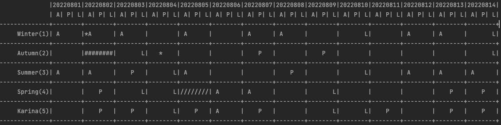
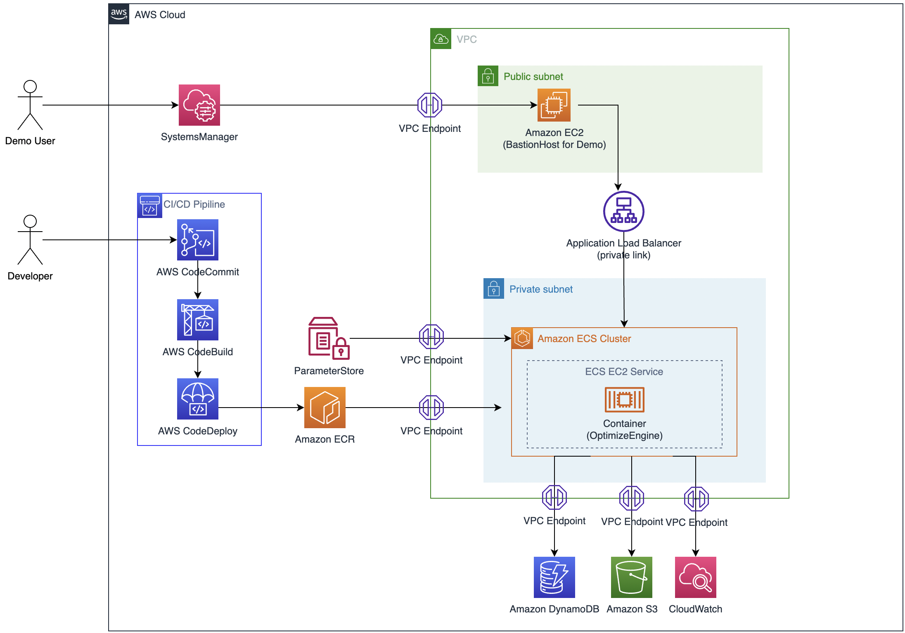

# Employee Shift Scheduling Optimization
## Introduction
This project let you provision employee shift scheduling application using Amazon ECS. The application provides REST API using a private loadbalancer. The infrastructure code is using [AWS Cloud Development Kit(AWS CDK)](https://aws.amazon.com/cdk/), and the DevOps pipeline is configured using [AWS CodePipeline](https://aws.amazon.com/codepipeline/).



## Getting Started

### Project Config
1. Create an AWS Profile on your development machine to deploy this project (e.g.: `my-deployment-profile`)
1. Navigate to `infra/config`
   1. Copy the `default.yml` file to a new file `local-XXXXXXXXXXXX.yml` where `XXXXXXXXXXXX` is your AWS ACCOUNT ID
   1. Replace the config settings to your own values. Mandatory changes to `account`, `administratorEmail` fields

1. Make sure you have all the required tools installed on your dev machine (*tested on mac*).

### Deployment
1. Check project config

1. Navigate to the root of the project and edit the variables of `deploy_stacks.sh`.

   > IMPORTANT: Make sure the `namespace` values match in `infra/config` and in the `deploy_stacks.sh` script

1. Then run the deployment script
   
   ```sh
   ./deploy_stacks.sh
   ```

---

### Clean UP 
1. Check project config

1. Navigate to the root of the project and edit the variables of `destroy_stacks.sh`.

1. Then run the deployment script
   
   ```sh
   ./destroy_stacks.sh
   ```

## Development

### Optimization Engine
1. Check project config

1. Navigate to `opt_eingie/core/core-impl/src/main/resources`
   1. edit profile and region values in file `application.properties`

1. Navigate to `opt_eingie/apps/schedule-optimization-app/src/main/resources`
   1. edit profile and region values in file `application.properties`

1. Navigate to `opt_eingie/apps/schedule-optimization-app`
   1. unlock comment on line 77 to 79 `<systemProperties> block` in file `pom.xml`

1. Build and Run application
   1. navigate to opt_engine
   1. build maven project or run `build_schedule_optimization_app.sh`
   1. navigate to `opt_engine/apps/schedule-optimization-app/target`
   1. run `java -jar opt-engine-runner.jar`
   1. navigate to `opt_engine/scripts`
   1. run `rest_solve.sh`

## Architecture

### Solution Architecture


### Folder structure
```
.
├── infra (cdk application to deploy cloud resources)
├── docs (detailed documentation)
└── opt_engine (optimization engine)
```

## Requirements

### Dev Tools

* `nvm` with nodejs `v16` installed
* `yarn`
* `docker`
* `zip`
* `jq`
* `openjdk` version `v11` or higher (jdk17 preffered)
* `vscode` with `eslint` plugin (preferred)

### AWS

* AWS Account Access ([setup](https://aws.amazon.com/premiumsupport/knowledge-center/create-and-activate-aws-account/)) with enough permission to deploy the application
* [AWS CLI version 2](https://docs.aws.amazon.com/cli/latest/userguide/install-cliv2.html) with [named profile setup](https://docs.aws.amazon.com/cli/latest/userguide/cli-configure-profiles.html)

## License

This sample project is licensed under the MIT-0 License. See the LICENSE file.
